# Introducción
Esta es una introducción sobre cómo crear una aplicación usando Kotlin y Android Studio.
La aplicación se trata de una lista que va a ir almacenando las palabras que el usuario va a ir ingresando en un campo de texto.
La app en cuestión se vería así:

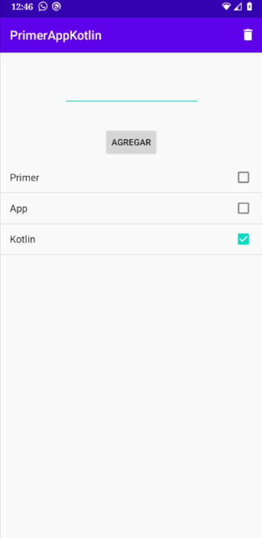

Para este tutorial vamos a utilizar el programa **Android Studio**, el cual podemos descargar a través del siguiente link:

[Descargar Android Studio](https://developer.android.com/studio)

## Creando proyecto

Una vez descargado e instalado el programa y los SDK correspondientes, vamos a proceder a crear un nuevo proyecto en **File > New > New Project**. Vamos a ver una ventana como la siguiente:

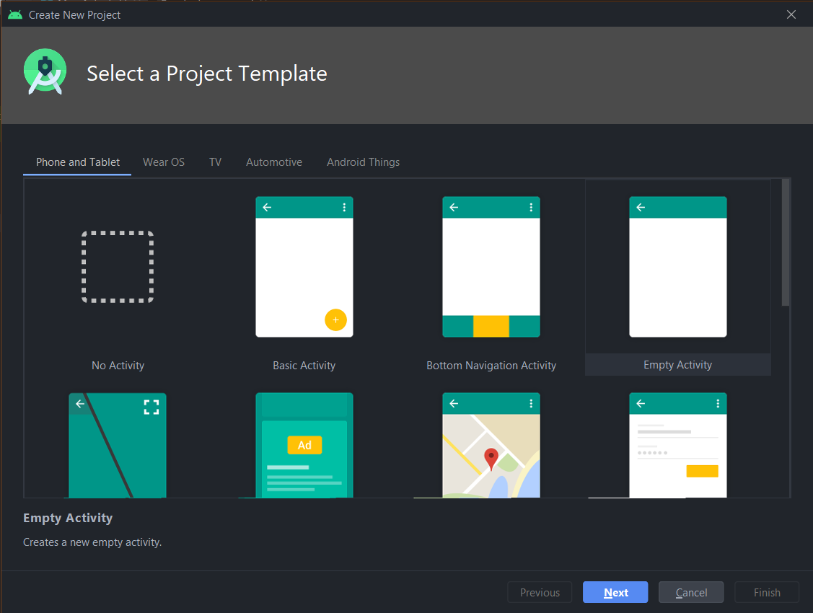

Vamos a seleccionar "Empty Activity" y luego presionamos "Next". Ahora vamos a ver una ventana como ésta:

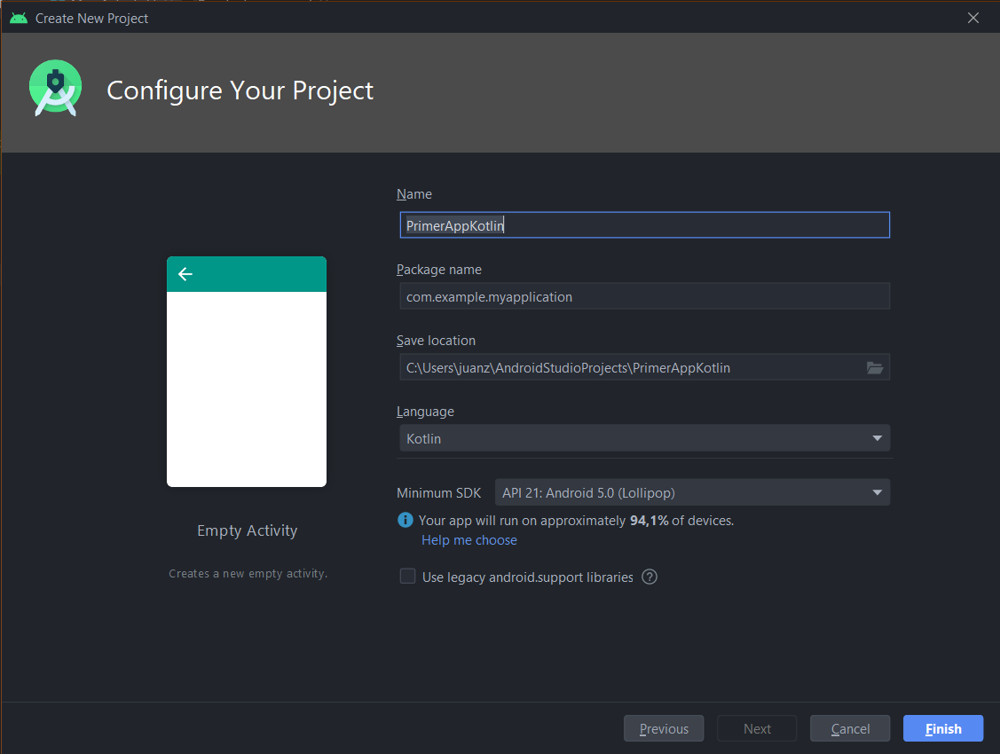

En "Name" vamos a poner "PrimerAppKotlin" y en "Language" elegimos "Kotlin". Luego apretar el botón Finish y el proyecto comenzará a crearse.
Una vez creado el proyecto, vamos a ver una ventana como la siguiente:

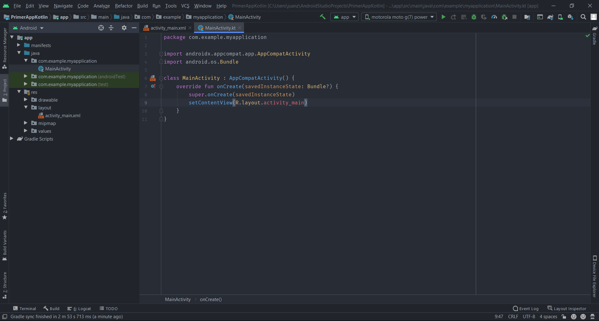

Acá vamos a ver dos principales archivos, **"MainActivity.kt"** y **"activity_main.xml"**. Éstos archivos son los pilares de toda aplicación Android, y van a ser usados en conjunto para darle el funcionamiento y la UI a la aplicación.  
El archivo **"MainActivity.kt"** es en dónde vamos a colocar todo el código que le da el funcionamiento a nuestra aplicación; y el archivo **"activity_main.xml"** es en donde vamos a modificar la UI de la aplicación (botones, campos de texto, etc).

## Primera parte: UI

Primero que nada, vamos a empezar creando la UI para nuestra aplicación. Vamos a ir al archivo **activity_main.xml** y vamos a poner el siguiente código:

``` xml
<?xml version="1.0" encoding="utf-8"?>
<androidx.constraintlayout.widget.ConstraintLayout xmlns:android="http://schemas.android.com/apk/res/android"
    xmlns:app="http://schemas.android.com/apk/res-auto"
    xmlns:tools="http://schemas.android.com/tools"
    android:layout_width="match_parent"
    android:layout_height="match_parent"
    tools:context=".MainActivity">

    <EditText
        android:id="@+id/editText"
        android:layout_width="wrap_content"
        android:layout_height="wrap_content"
        android:inputType="textFilter"
        android:ems="10"
        app:layout_constraintTop_toTopOf="parent" android:layout_marginEnd="8dp"
        app:layout_constraintEnd_toEndOf="parent" android:layout_marginStart="8dp"
        app:layout_constraintStart_toStartOf="parent" android:layout_marginTop="40dp" />

    <Button
        android:id="@+id/buttonAdd"
        android:layout_width="wrap_content"
        android:layout_height="wrap_content"
        android:text="AGREGAR"
        android:layout_marginTop="8dp"
        app:layout_constraintTop_toBottomOf="@+id/editText"
        app:layout_constraintBottom_toBottomOf="parent" app:layout_constraintStart_toStartOf="parent"
        android:layout_marginStart="8dp" app:layout_constraintEnd_toEndOf="parent" android:layout_marginEnd="8dp"
        app:layout_constraintHorizontal_bias="0.498" app:layout_constraintVertical_bias="0.04" />

    <ListView
        android:id="@+id/listView"
        android:layout_width="match_parent"
        android:layout_height="0dp"
        tools:layout_editor_absoluteX="0dp" android:layout_marginTop="8dp"
        app:layout_constraintTop_toBottomOf="@+id/buttonAdd" android:overScrollMode="ifContentScrolls"
        android:verticalScrollbarPosition="right" app:layout_constraintBottom_toBottomOf="parent"
        app:layout_constraintVertical_bias="0.0" android:layout_marginBottom="20dp" />

</androidx.constraintlayout.widget.ConstraintLayout>
```

Acá estamos poniendo un campo de texto (EditText), un botón (Button) y una lista (ListView).

## Segunda parte: Funcionalidad del botón

Ahora nos vamos a colocar en el archivo **MainActivity.kt**, que debería verse así:

``` kotlin
package com.example.primerappkotlin

import androidx.appcompat.app.AppCompatActivity
import android.os.Bundle

class MainActivity : AppCompatActivity() {
    override fun onCreate(savedInstanceState: Bundle?) {
        super.onCreate(savedInstanceState)
        setContentView(R.layout.activity_main)
    }
}
```

Dentro de la función **_onCreate_** vamos a poner todo el código necesario para que la app funcione. Esto es porque cuando se abre la aplicación, se ejecuta la función onCreate del MainActivity, y Android empieza a recorrer todo lo que está dentro de esta función.

Lo siguiente que vamos a hacer es crear la constante "texto", que va a llamar al EditText que creamos en el layout y va a tomar el texto que esté escrito actualmente en el mismo.
Recordemos que en kotlin, _var_ es para declarar variables y _val_ para declarar constantes. El tipo de dato no se especifica salvo que sea muy necesario.

``` kotlin
val texto = editText.text
```

Los imports generalmente los hace solos o te resalta en rojo y te pide que importes los archivos necesarios, pero por las dudas, dejo los imports necesarios abajo de cada pieza de código.
Los imports van arriba de todo, junto a los otros imports.

``` kotlin
import kotlinx.android.synthetic.main.activity_main.*
```

Lo siguiente que vamos a hacer es agregarle un listener al botón "AGREGAR". Esto significa que le vamos a decir al botón exactamente lo que queremos que haga.

``` kotlin
buttonAdd.setOnClickListener {
}
```

Una vez dentro del listener, vamos a evaluar si el EditText está vacío; si lo está, vamos a mostrar un error que nos pide que agreguemos algún texto.

``` kotlin
buttonAdd.setOnClickListener {

    if (texto.isEmpty()) {
        editText.error = "El campo está vacío. Por favor, escribe algo para poder continuar"
    }
    else {
        editText.error = null
    }

}
```

Se vería así:

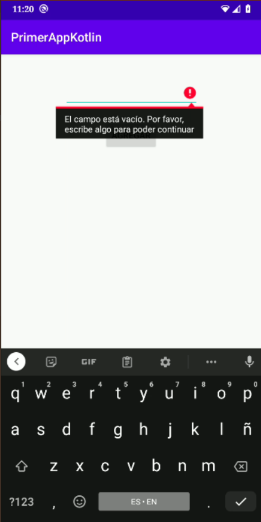

## Tercera parte: Agregando elementos a la lista

Ahora vamos a agregar los elementos a la lista. Para esto, necesitamos tener un adaptador y un array que nos permita manejar los datos que queremos ingresar a la lista.
Primero, vamos a inicializar el adaptador y el array, que van colocados fuera del **_onCreate_**, más precisamente arriba.

``` kotlin
private var arrayAdapter: ArrayAdapter<String>? = null
private val items: ArrayList<String> = arrayListOf()
```

Ahora vamos a proceder a llamar al objecto ArrayAdapter(), redefiniendo nuestra variable arrayAdapter, dónde vamos a especificar el tipo de lista que queremos (en este caso, multiple choice) y el nombre del array que vamos a utlilizar. Esto lo vamos a hacer dentro del **_onCreate_** y justo debajo de nuestra constanto **texto**.
También vamos a decirle a listView qué tipo de lista vamos a utilizar.


``` kotlin
arrayAdapter = ArrayAdapter(this, android.R.layout.simple_list_item_multiple_choice, items)

listView.choiceMode = ListView.CHOICE_MODE_MULTIPLE
```

Lo siguiente es agregarle la funcionalidad al botón para que podamos agregar los elementos a la lista. El listener quedaría así:

``` kotlin
buttonAdd.setOnClickListener {
    if (texto.isEmpty()) {
        editText.error = "El campo está vacío. Por favor, escribe algo para poder continuar"
    }
    else {
        editText.error = null
        items.add(texto.toString())
        texto.clear()
        listView.adapter = arrayAdapter
    }
}
```

Imports:

``` kotlin
import android.widget.ArrayAdapter
import android.widget.ListView
```

Y listo! Ya agregamos la funcionalidad para agregar los items a la lista.

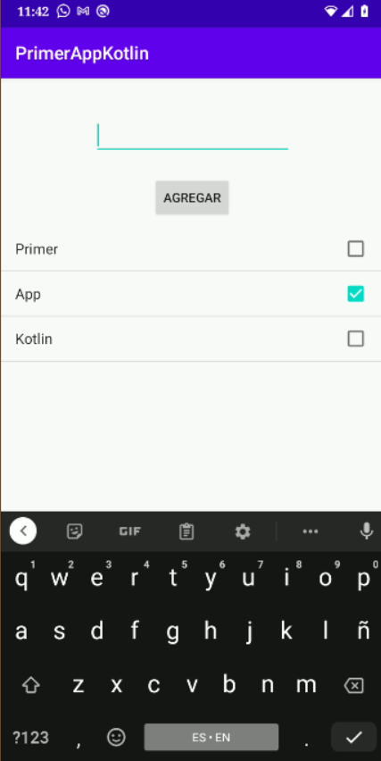

Pero todavía no terminamos. Nos falta crear la funcionalidad que nos permita borrar los elementos. Pero, ¿cómo?

## Cuarta parte: Menu e ícono del botón borrar

Para empezar, hacemos click derecho en la carpeta **res**, y vamos a **New > Android Resource Directory**

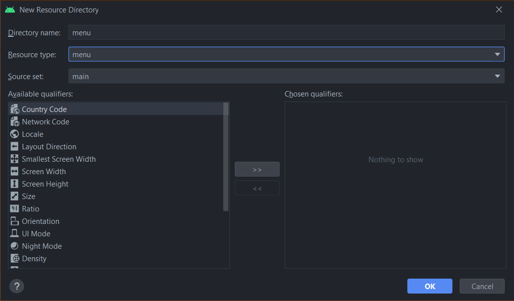

En **Resource type** seleccionamos la opción **menu** y le damos a "OK". Ahora seguir estos pasos:
- Click derecho en la carpeta **res/menu**
- Click en **New > Menu Resource File**
- **File name: "delete_button"**
- Click en "OK"

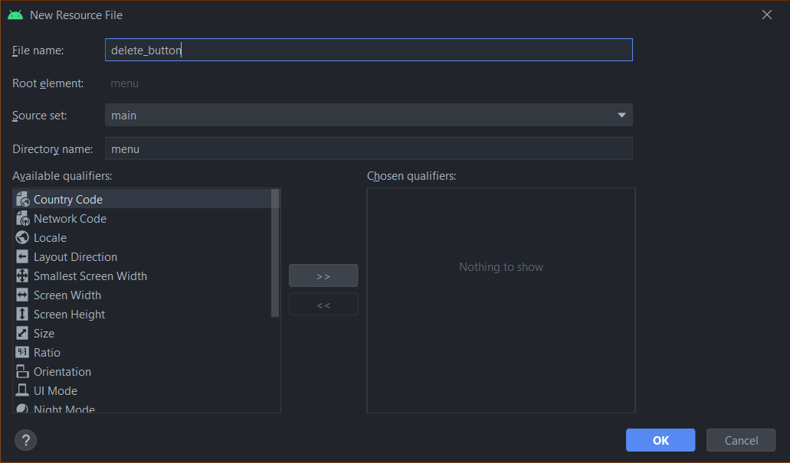

Una vez creado el archivo **"delete_button.xml"**, reemplazar el código por el siguiente:

``` xml
<?xml version="1.0" encoding="utf-8"?>
<menu xmlns:app="http://schemas.android.com/apk/res-auto"
    xmlns:android="http://schemas.android.com/apk/res/android">
    <item
        android:id="@+id/delete_items"
        android:icon="@drawable/ic_baseline_delete_24"
        android:title="Item"
        app:showAsAction="always" />
</menu>
```

Ahora, vamos a hacer click derecho en la carpeta **drawable** y vamos a hacer click en **New > Vector Asset**. Una vez dentro, en **Clip art**, buscar un ícono que represente un tacho de basura, más específicamente el ícono **"delete"**. Ahora **Color** elegimos el color blanco (#FFFFFF) y el **Name** lo dejamos como está. Damos en **Next** y luego en **Finish**.

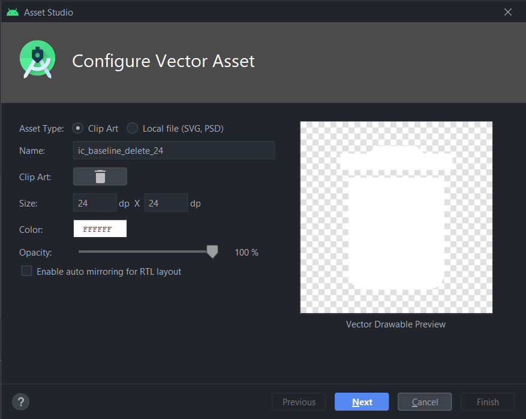

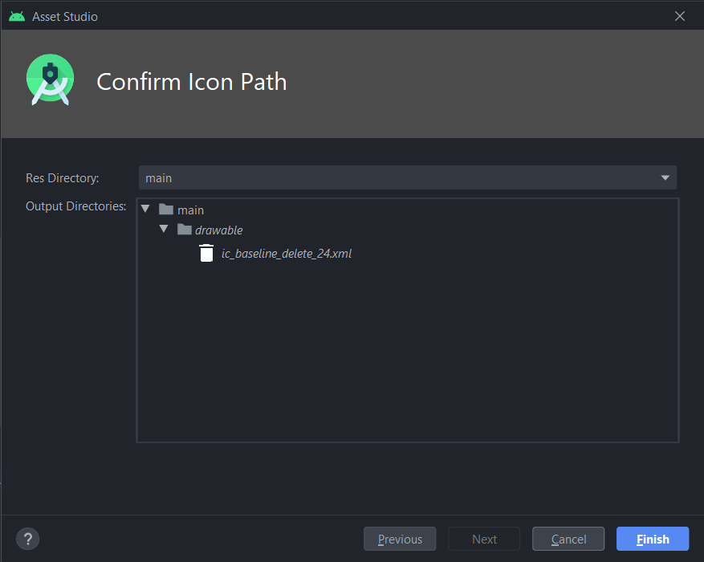

## Quinta parte: Funcionalidad del botón borrar

Ahora nos vamos a colocar nuevamente en **MainActivity.kt** y afuera, por debajo de **_onCreate_**, vamos a colocar lo suiguiente:

``` kotlin
override fun onCreateOptionsMenu(menu: Menu?): Boolean {
    menuInflater.inflate(R.menu.delete_button, menu)
    return super.onCreateOptionsMenu(menu)
}

override fun onOptionsItemSelected(item: MenuItem): Boolean {
    return super.onOptionsItemSelected(item)
}
```

- **onCreateOptionsMenu** se usa para inflar el ícono y que lo muestre en la activity.
- **onOptionsItemSelected** se usa para darle funcionalidad cuando lo presionamos.

El ícono se debería ver así:

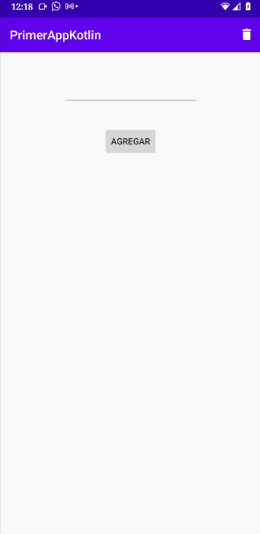

Cómo vemos, hay un ícono arriba a la derecha, el cuál vamos a utlizar para borrar los elementos de la lista que seleccionemos.

Dentro de la función **onOptionsItemSelected** y debajo del **return super.onOptionsItemSelected(item)** vamos a llamar a nuestro botón borrar y le vamos a dar funcionalidad.
Primero, vamos a proceder a cambiar ****return super.onOptionsItemSelected(item)**** por ****super.onOptionsItemSelected(item)**** y debajo de eso ponemos:

``` kotlin
when (item.itemId) {
    R.id.delete_items -> {
    }
}
return true
```

Esto significa que cuando el ID del ítem seleccionado sea "delete_items" se ejecute el código dentro de las llaves.

Dentro de **R.id.delete_items -> {}** vamos a poner el siguiente código:

``` kotlin
val positionChecker = listView.checkedItemPositions
val count = listView.count

for (i in count-1 downTo 0) {

    if (positionChecker.get(i)) {
        arrayAdapter?.remove(items[i])
        Toast.makeText(applicationContext, "Elemento(s) borrado(s) exitosamente", Toast.LENGTH_LONG).show()
    }

}

positionChecker.clear()

arrayAdapter?.notifyDataSetChanged()
```

Se crea la constante **positionChecker** que se va a utilizar para saber que ítems están seleccionados y que valor tienen en el index de la lista.

La constante **count** sirve para hacer el conteo de la cantidad de items existentes dentro de la lista.

Vamos a hacer un **for** que recorra la lista desde el último elemento hasta el primer elemento y va a evaluar si en la lista hay un elemento que tiene como valor **positionChecker**, y va a proceder a eliminar ese elemento. Vamos a crear un **Toast**,
que no es más que una alerta que nos va a avisar que hemos borrado un elemento.

Una vez que el **for** termina de evaluar la lista, vamos a limpiar el **positionChecker** para que no almacene indexes que ya no existen y vamos a actualizar la lista con **arrayAdapter?.notifyDataSetChanged()** para poder ver el cambio.

Finalmente, se debería así:

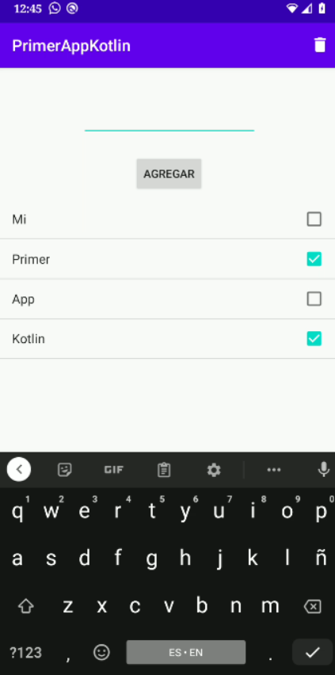

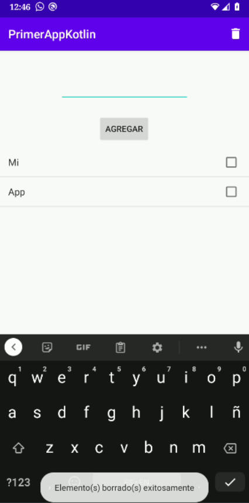

Imports:

``` kotlin
import android.view.Menu
import android.view.MenuItem
import android.widget.Toast
```

**El código fuente se ecuentra [aquí](/app/src/main/java/com/example/primerappkotlin/).**

### Documentación

[Android Developers Documentation](https://developer.android.com/docs)

[Kotlin Documentation](https://kotlinlang.org/docs/reference/)
